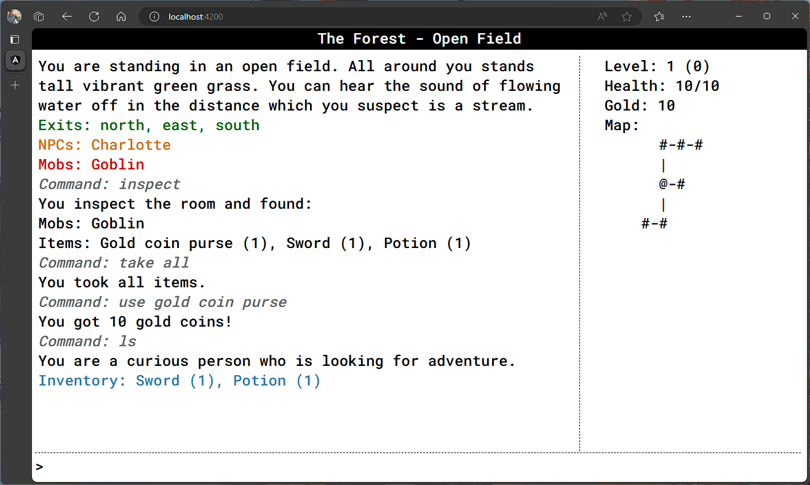

# TextWorld

A text based role playing game engine written in TypeScript on Deno with an 
Angular frontend. This is still a work in progress but there is a lot here. 
There is a strong focus on test driven design although we don't currently have
100% code coverage.

The current focus is more on the game engine and less on the little world that
was created to play in. This will change as time moves on.

## Screenshot(s)

## TODO

- [x] Command line interface
- [x] Parser
- [x] Rooms/Zones
- [x] Room/Zone movement
- [x] Items (pickup, use, drop)
- [x] Objects (look, examine)
- [x] Crafting
- [x] NPCs
- [x] NPC interaction
- [x] Vendors
- [x] Quests
- [x] Mapping
- [x] Basic command help
- [x] Combat
- [x] Exposed through WebSocket server
- [x] Exposed through command line interface
- [x] Web UI
- [x] Spawn Locations
- [x] Save/Load (uses Deno KV)
- [ ] Leveling

## Run

NOTE: Because we are using Deno.Kv we need to pass the --unstable flag

Backend:

> deno run --unstable --allow-read --allow-write --allow-net .\textworld_game.ts

Frontend:

NOTE: Requires Node.js and Angular CLI

> ng serve

## Test

NOTE: Because we are using Deno.Kv we need to pass the --unstable flag

> deno test --unstable --allow-read --allow-write .\textworld_tests.ts

## Author(s)

Frank Hale &lt;frankhale AT gmail.com&gt;

## Date

25 November 2023
